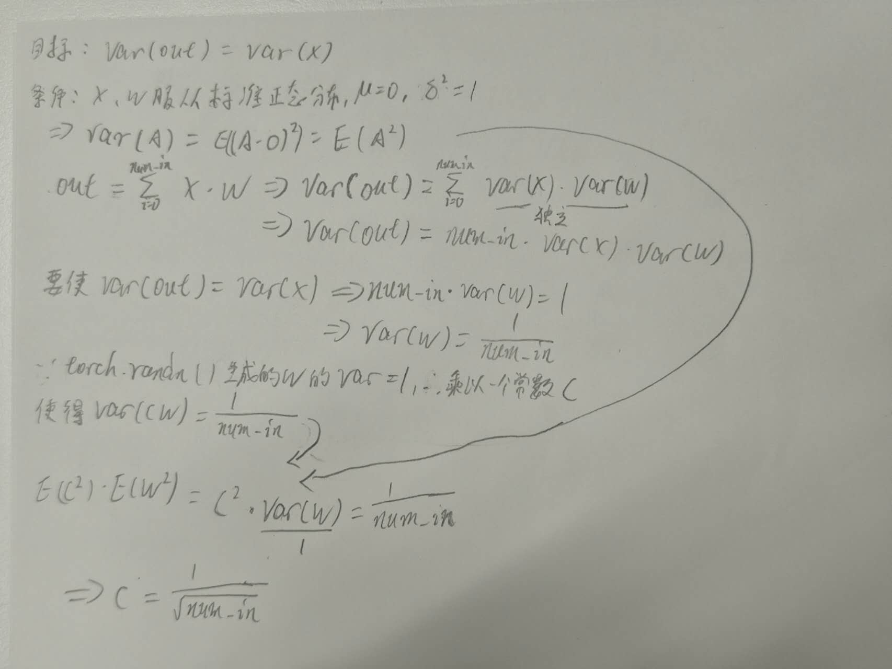

- float32: 32 bit = 4 bytes (1 bytes = 8 bit)

- Pytorch的切片、view、transpose操作是原地操作，返回的是内存地址而不是生成新的tensor

- transpose会造成内存不连续...这个也比较好理解，比如

  ```python
  x = torch.tensor([[0, 1, 2], [3, 4, 5]])
  y = x.transpose(1, 0)
  ```

  实际在内存中排列为`0, 1, 2, 3, 4, 5`，transpose后

  ```python
  y = [[0, 3], [1, 4], [2, 5]]
  # 此时内存中是跳着读取元素的，所以肯定不连续！！！
  y = y.contiguous()
  ```

  现在y的内存排序为`0, 3, 1, 4, 2, 5`，因此x与y不在共用内存地址。

- `reshape` = `contiguous().view()`

  ```python
  x = torch.tensor([[1, 2, 3], [4, 5, 6]])
  y = x.transpose(1, 0).reshape(2, 3)
  assert check_memory_address(x) != check_memory_address(y)
  ```

- tensor.rsqrt()

  ```python
  x = torch.tensor([1, 4, 9])
  assert torch.equal(t.rsqrt(), torch.tensor([1/1, 1/2, 1/3])) # x**(-0.5)，会生成新的内存地址
  ```

- 矩阵乘法计算量

  ```python
  x = torch.randn(2, 3)
  y = torch.randn(3, 2)
  l = x @ y
  '''
  输出shape为(2, 2)，因此总共有4次运算
  每次运算包含3个元素，由乘、加组成
  因此FLOPs = 2 * 2 * 3 * 2
  '''
  ```

  

- 反向传播计算量

  ```python
  x = torch.randn(2, 3)
  y = torch.randn(3, 2)
  l = x @ y
  '''
  l.shape = (2, 2)
  dl/dx = dl @ y.grad.T # 2 * (2 * 2 * 3)
  dl/dy = x.grad.T @ dl # 2 * (3 * 2 * 2)
  因此FLOPs = 2 * 2 * (2 * 2 * 3)
  总结来说就是反向传播FLOPs为两倍的正向传播计算量
  '''
  ```

- ```python
  x = nn.Parameter(torch.randn(num_in))
  w = nn.Parameter(torch.randn(num_in, hidden_dim)) / np.sqrt(num_in)
  out = x @ w
  ```

  为什么w初始化要除以num_in**0.5?

  为了使得梯度不会消失/爆炸，所以`var(out) == var(x)`

  

  因此开根号的本质原因是因为计算方差时候(x-μ)**2，求了一个平方数。

- 
