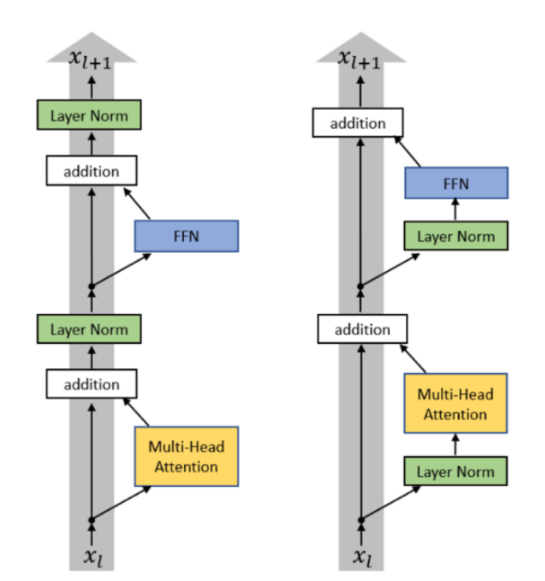

### 魔改版Transformer对比原版的区别

- 将归一化模块放到了Attention以及FFN之前
  

### 归一化函数

- 使用`RMSNorm`代替`LayerNorm`，代替原因是这两个Norm方法效果差不多，但是RMSNorm更加简单，并且在模型训练中，Normalization非常耗时，所以越简单越好。
  **LayerNorm**:
  $$
  y = \frac{x - \mathbb{E}[x]}{\sqrt{\text{Var}[x] + \epsilon}} \cdot \gamma + \beta
  $$
  **RMSNorm**:
  $$
  y = \frac{x}{\sqrt{\frac{1}{n}\sum_{i=1}^{n}x_i^2 + \epsilon}} \cdot \gamma
  $$
  或者
  $$
  y = \frac{x}{\sqrt{||x||_2^2 + \epsilon}} \cdot \gamma
  $$

- 去掉bias偏置参数

### 激活函数

- **GLU**
  GLU (Gated Linear Unit) 的核心思想是使用一个门控机制来动态地控制信息流，让网络可以根据输入内容来决定哪些信息应该通过。
  $$
  \text{GLU}(x, W, V, b, c) = (xW + b)\otimes \sigma(xV + c)
  $$
  这个公式的意思是，输入 x 被两个独立的线性变换（xW+b 和 xV+c）分别处理。一个结果作为内容（content），另一个经过 Sigmoid 函数后作为“门”（gate）。门的值在 0 到 1 之间，决定了对应位置的内容有多少可以通过。

- **SwiGLU**
  $$
  \text{SwiGLU}(x, W, V) = (xW) \otimes \text{SiLU}(xV)
  $$
  其中
  $$
  \text{SiLU}(x) = x\cdot\sigma(x)=\frac{x}{1+e^{-x}}
  $$

- **GeGLU**
  $$
  \text{GeGLU}(x, W, V) = (xW) \otimes \text{GELU}(xV)
  $$
  其中
  $$
  \text{GELU}(x)\approx0.5\cdot{x}\cdot(1+\text{tanh}[\sqrt{\frac{2}{\pi}}({x}+0.044715 \cdot{x^3})])
  $$
  GELU(gate)建议直接套用`F.gelu(gate)`实现

- transformer中间隐藏层的维度似乎是模型输入x维度的4倍比较合理。使用GLUs激活函数的情况下这个值为8/3。
- transformer中head的维度一般遵循：Head_dim * Num_head = D，这里的D是指模型输入x维度。
- 模型的宽度（最后一维的大小）/模型层数（模型深度）比叫做aspect ratio；一般这个比值是100~156左右，宽远远大于深度。
- **weight decay**；主要是指学习率的衰减。现在主流模型都使用cosine LR decay。此外现在模型越来越少用Dropout层了。

- **RoPE: rotary position embeddings**
  本质上是一种位置编码的方式。参考[视频链接](https://www.youtube.com/watch?v=o29P0Kpobz0&t=351s) 将单词在句子中的位置通过旋转来表示，比如第m个单词，那么就让该单词旋转mθ度，θ是一个人为定义的单位
  $$
  \theta_j=10000^{-\frac{2j}{d}}
  $$
  其中j取值范围为[0, d//2-1]，d为embedding后的维度。
  让KQV中的KQ都乘以mθ度的旋转矩阵
  $$
  ROT(m\theta)=\left(\begin{matrix}
     cos(m\theta) & -sin(m\theta) \\
     sin(m\theta) & cos(m\theta) \\
    \end{matrix}\right)
  $$
  实现代码查看`code.py`

- **z-loss**
  softmax的一个弱点是它只关注相对大小而忽视绝对大小。比如z1 = [10, 1, 1]与z2 = [1010, 1001, 1001]的softmax结果是一样的。训练中可能出现logits的值非常大，而没有什么约束机制，可能造成数值溢出、梯度太大等问题。z-loss对 logit 的大小进行直接惩罚。
  z-loss就是在传统crossentropy_loss基础上加上一个z_loss项
  $$
  L\_{\text{total}} = L\_{\text{cross\_entropy}} + L\_{z}
  $$
  其中
  $$
  L\_{z} = \alpha\cdot(log{Z})^2
  $$
  

